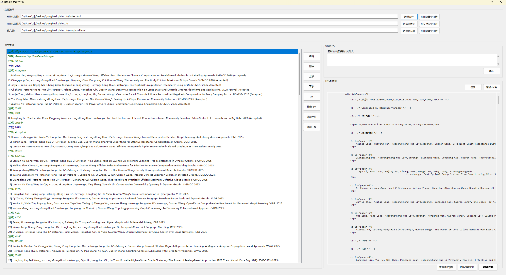

# HTML 论文管理工具

这是一个基于 .NET WinForms 的论文文献管理工具，专门用于处理和编辑 HTML 格式的学术论文列表。

## 功能特点

- **HTML 文件解析**：读取并解析现有的 HTML 论文列表文件
- **论文条目编辑**：提供直观的界面编辑论文信息（标题、作者、发表信息等）
- **智能插入**：根据论文重要性自动插入到合适位置
- **链接管理**：支持 PDF 文件和代码链接的添加和管理
- **预览功能**：实时预览论文条目的 HTML 效果
- **批量操作**：支持论文条目的复制、删除等批量操作

## 系统要求

- Windows 操作系统
- .NET Framework 4.7.2 或更高版本
- Visual Studio 2019 或更高版本（开发）

## 使用方法

1. 启动程序后点击"加载 HTML 文件"选择要编辑的论文列表文件
2. 在左侧列表中选择要编辑的论文条目，或点击"新增论文"添加新条目
3. 在编辑对话框中填写论文信息，支持实时预览
4. 编辑完成后点击"保存 HTML 文件"导出结果

## 技术架构

- **界面框架**：Windows Forms
- **HTML 解析**：HtmlAgilityPack
- **开发语言**：C#
- **目标框架**：.NET 8.0

本工具特别适合需要维护学术网站论文列表的研究人员使用。
├── App.config                     # 应用配置
└── README.md                      # 说明文档

## 依赖包

- **HtmlAgilityPack**: 用于HTML文档的解析和处理

## 使用说明

### 1. 打开HTML文件
1. 点击"选择文件"按钮
2. 选择包含论文列表的HTML文件
3. 程序会自动解析文件中的论文条目

### 2. 管理论文条目
- **添加论文**: 点击"添加论文"按钮，在对话框中输入论文信息
- **编辑论文**: 选中条目后点击"编辑"按钮
- **删除论文**: 选中条目后点击"删除"按钮
- **移动条目**: 使用"上移"和"下移"按钮调整条目顺序

### 3. 添加特殊条目
- **年份标记**: 点击"添加年份"按钮，输入年份
- **注释条目**: 点击"添加注释"按钮，输入注释内容

### 4. 智能导入
1. 在"论文导入"区域的文本框中粘贴论文信息
2. 支持的格式：`作者: 标题. 发表信息`
3. 点击"导入"按钮自动解析并添加

### 5. 导出HTML
1. 完成编辑后，点击"导出HTML"按钮
2. 选择保存位置
3. 生成的HTML将保持原有格式和缩进

## 智能解析功能

### 作者处理
- 自动将"Rong-Hua Li"用`<strong>`标签包裹
- 支持通讯作者标记（*号处理）
- 保持原有的作者格式

### 链接管理
- PDF链接默认路径: `./PaperFiles/[论文标题].pdf`
- Code链接默认: `https://github.com/ronghuali`
- 支持链接的显示/隐藏控制（用HTML注释实现）

### 年份提取
- 自动从发表信息中提取年份
- 支持格式: `(2025)`, `2025年` 等

## 开发说明

### 编译项目
1. 确保安装了.NET Framework 4.7.2或更高版本
2. 打开项目文件或解决方案
3. 还原NuGet包（HtmlAgilityPack）
4. 编译项目

### 扩展功能
- 模型类在`Models`文件夹中，可扩展Paper类的属性
- 服务类在`Services`文件夹中，可扩展解析和生成逻辑
- UI组件可以在设计器中进行调整

## 注意事项

1. **HTML格式要求**: 输入的HTML文件必须包含`
`节点
2. **编码支持**: 支持UTF-8编码的HTML文件
3. **备份建议**: 在使用工具之前建议备份原始HTML文件
4. **链接路径**: PDF和Code链接支持相对路径和绝对路径

## 常见问题

### Q: 程序无法解析HTML文件？
A: 请确保HTML文件包含正确的`
`结构，且文件编码为UTF-8。

### Q: 生成的HTML格式不正确？
A: 程序会尽量保持原有的HTML格式和缩进，如果出现问题请检查原始文件的结构。

### Q: 如何处理特殊字符？
A: 程序会自动处理HTML转义字符，无需手动处理。

## 版本信息

- 版本: 1.0.0
- 发布日期: 2025年
- 兼容性: .NET Framework 4.7.2+

## 许可证

本项目仅用于学术和个人用途。
